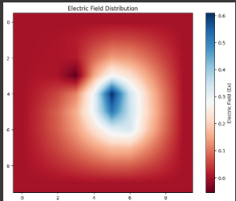
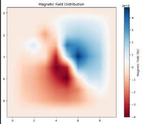

# Electromagnetic Field Simulation with 2D Grid using Meshing and Boundary Conditions

## Overview
This project is a C++ implementation of an electromagnetic wave simulation. It calculates the electric and magnetic fields across a 2D grid using a structured mesh. The goal is to demonstrate wave propagation and field interactions based on Maxwell's equations. The results can be exported as CSV files and visualized using Python.

## Features
- **Mesh Generation**: Structured 2D triangular mesh generation with adjustable grid size.
- **Electromagnetic Wave Propagation**: Simulates electromagnetic wave propagation through the mesh by calculating the electric and magnetic fields across a 2D grid.
- **Absorbing Boundary Conditions**: Reduces reflections at boundaries to simulate open-space propagation.
- **CSV Output**: Saves the electric and magnetic fields at each time step for visualization in external tools.
- **Python Visualization**: Plot and visualize the electromagnetic wave propagation using Python.

## Dependencies
This project relies on the following libraries:

- **Eigen**: C++ template library for linear algebra.
- **vcpkg**: C++ package manager for handling dependencies like Eigen.
- **Google Test**: Used for unit testing the simulation.

## Installation and Setup

### Prerequisites
Make sure you have Visual Studio and vcpkg installed.

### Steps:

1. **Clone the repository**:
   ```sh
   git clone https://github.com/GhaziBenHenia/Electromagnetic-Field-Simulation-with-2D-Grid-using-Meshing-and-Boundary-Conditions.git
   cd Electromagnetic-Field-Simulation-with-2D-Grid-using-Meshing-and-Boundary-Conditions
   ```

2. **Install vcpkg (if not already installed)**:
   ```sh
   git clone https://github.com/microsoft/vcpkg.git
   ./vcpkg/bootstrap-vcpkg.bat
   ```

3. **Install dependencies**: Use vcpkg to install Eigen and Google Test:
   ```sh
   ./vcpkg/vcpkg install eigen3 gtest
   ```

4. **Open the project in Visual Studio**:
   - Open the `.sln` or `.vcxproj` file in Visual Studio.
   - Make sure your vcpkg installation is integrated.

5. **Build the project**:
   - Select your configuration.
   - Build the solution (press F7).

6. **Run the simulation**:
   - Run the Tests to generate the electromagnetic field results and output the data to a CSV file.

## Running the Simulation
The results of the electric and magnetic fields are saved in a CSV file.

## Python Visualization
To visualize the simulation results, use the provided Python script:

1. **Install necessary Python packages**:
   ```bash
   pip install numpy matplotlib pandas
   ```

2. **Run the Python script for visualization**:
This will display the electric and magnetic field propagations over time.

## Unit Tests
This project includes unit tests to verify functionality:

- **Mesh Generation**: Ensures that the structured 2D triangular mesh is correctly generated.
- **Wave Propagation**: Validates the correctness of the wave propagation logic.
- **Boundary Conditions**: Verifies that the absorbing boundary conditions work as expected.

## Example Visualizations
Here’s a sample visualization of the wave propagation (generated by the Python script):




## Keywords
- Mesh
- Simulation
- Electromagnetic Waves
- Boundary Conditions
- C++
- Vcpkg
